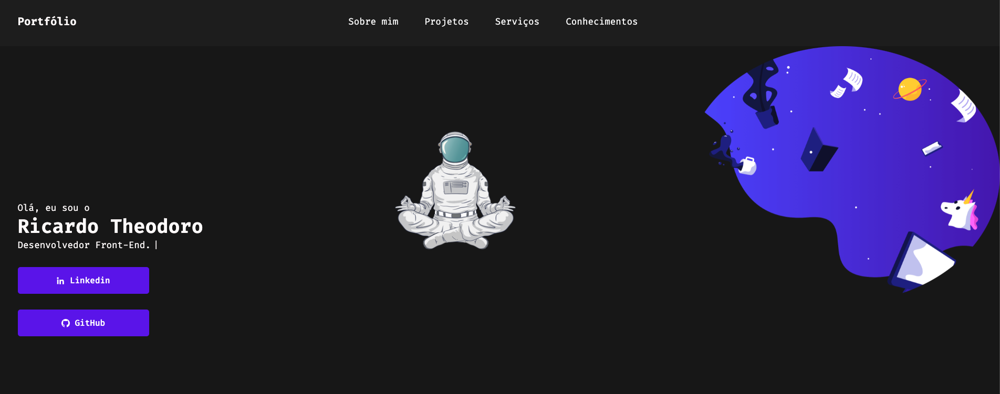

<h1 align="center">
  📰 Meu Portfólio
</h1>

<h4 align="center">
  Portfólio criado com o intuito de mostrar meus projetos ao decorrer dos meus estudos e carreira.
</h4>

<h4 align="center"><a href="https://rictheodoro.github.io/portfolio-theo/">Clique para visitar o projeto</a></h4>

## 📚 Seções

O site é composto por 5 seções diferentes:

- **Home:** Nele temos um avatar do meu github e um breve apresentação;
- **Sobre mim:** Nessa seção tenho uma descrição dizendo um pouco sobre mim;
- **Projetos:** Apresenta alguns projetos desenvolvidos e com link direto para os respectivos códigos no GitHub;
- **Serviços:** Exibe através de cards os diferentes serviços em que possuo conhecimentos;
- **Conhecimentos:** Nele apresentamos meus conhecimentos em algumas linguagens como o foco no front-end;

---

## 💼 Tecnologias utilizadas

Para o desenvolvimento deste site utilizei as seguintes tecnologias:

- HTML;
- Sass;
- JavaScript;
- Jquery;
- ScrollReveal;

---

## Autor 

<table>
  <tr>
    <td align="center">
      <a href="https://github.com/Rictheodoro">
         
        
          <b>Ricardo Theodoro</b>
        
      </a>
    </td>
  </tr>
</table>
